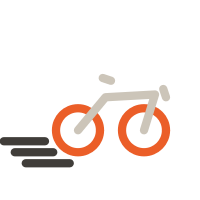
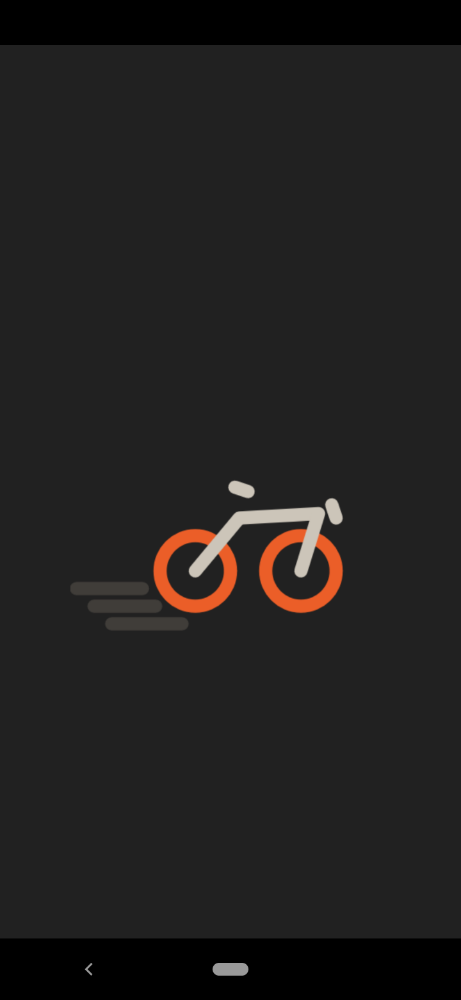
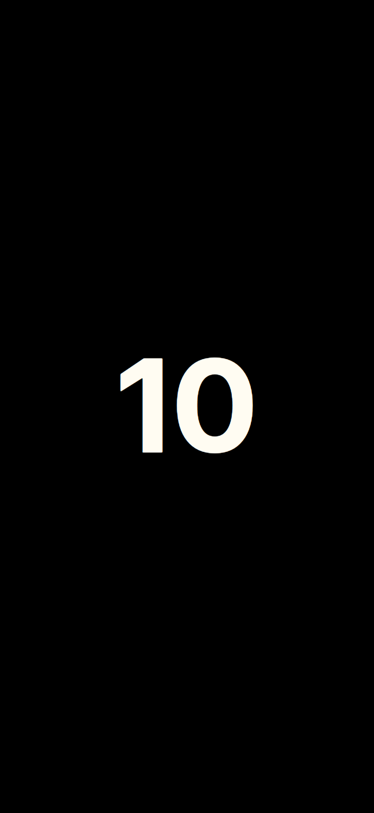

# Bike Route Tracker 

## Overview

Very simple app that tracks GPS position and works like a speedometer. You can start the location tracking, after countdown it starts measuring. While running it stores gps location and computes speed in kilometers per hour. Once paused (tapping on the speed), the tracking can be either resumed or stopped. On stop, it will save the gps route as gpx file in Documents.

